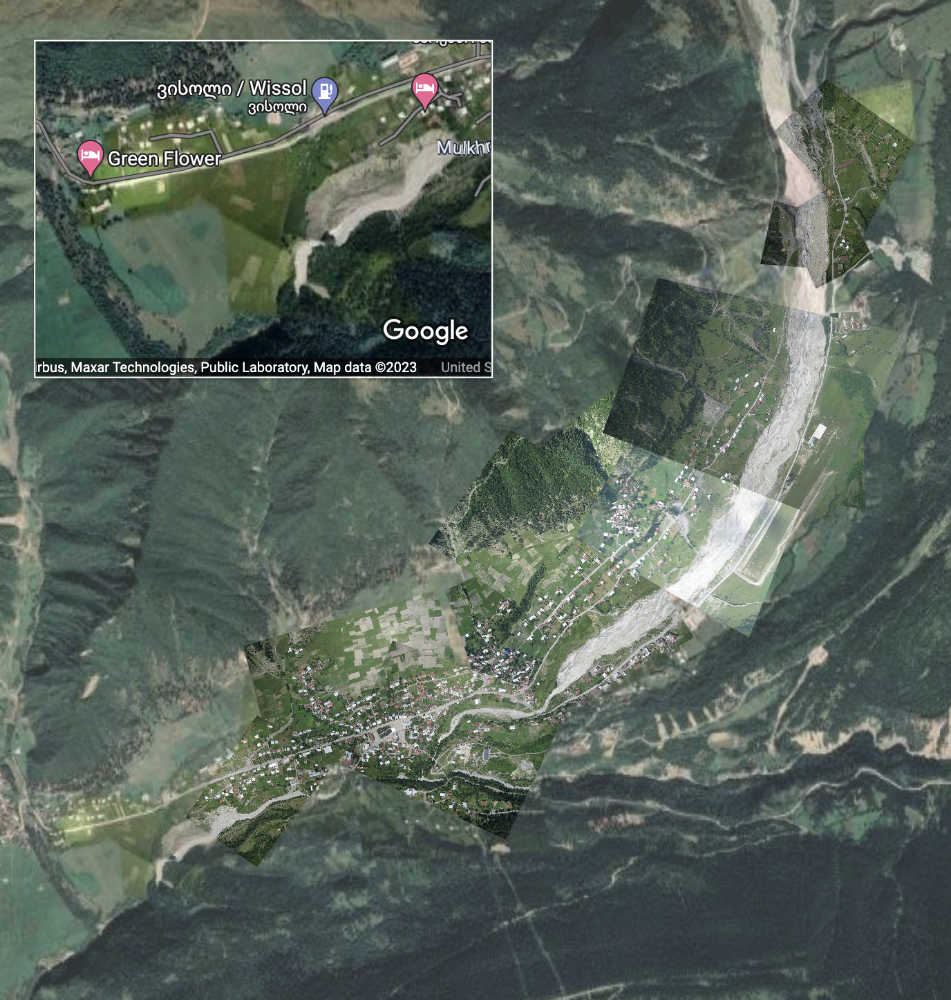
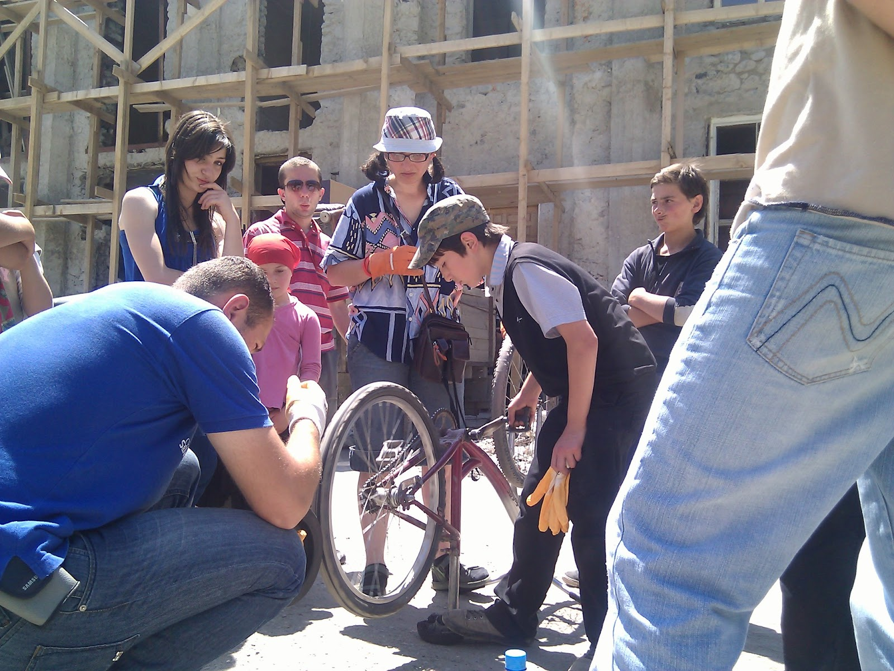
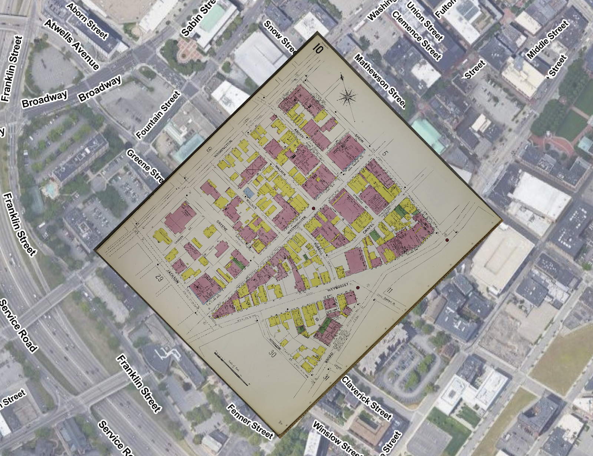

# MapKnitter is BACK 
_April 3, 2023_

MapKnitter is BACK, thanks to this winter’s Outreachy fellows! 👏🔥

In the most recently concluded Outreachy session, [@_malikktweets](https://twitter.com/_malikktweets) & [@adoughdough](https://twitter.com/adoughdough) worked together to create a lightweight replacement for [Public Lab’s](https://publiclab.org) [MapKnitter](https://mapknitter.org) service, which went offline last year. 

_A demo GIF of MapKnitter_

MapKnitter has been used by thousands of people to make their own aerial maps (a kind of DIY Google Earth), especially of areas of environmental disasters like the 2011 BP oil disaster. @publiclab community members take aerial photos from balloons, kites, & even long poles and combine or “knit” them into high resolution maps. 

> [Outreachy](https://outreachy.org) provides internships in open source and open science. Outreachy provides internships to people subject to systemic bias and impacted by underrepresentation in the technical industry where they are living.

And as always, we couldn’t have gotten so far without our fantastic mentors, [@CessWairimu254](https://twitter.com/CessWairimu254), [@B_eautifulChaos](https://twitter.com/B_eautifulChaos), and [@erhisoghenetega](https://twitter.com/erhisoghenetega). 🔥♥️

_A MapKnitter map of the city of Mestia._

MapKnitter has been used for many things over the years, and it’s good to remember that some MapKnitter maps have even been used by Google to provide higher resolution imagery for areas like Mestia, in the country of Georgia. And that this incredible map, which is still visible today on Google Maps, was created by residents of the city using a balloon, in 2011. 

_Using a bicycle to reel the balloon back in after a 4,400 foot high flight. https://flickr.com/photos/jeffreywarren/4774704789/_ 

## Example uses

One really exciting thing you can also do with this is to place historic maps over an interactive web map. For example, Sanborn insurance maps (such as those at the [Library of Congress](https://www.loc.gov/collections/sanborn-maps/about-this-collection/)) can be imported and lined up to see how they compare to present-day streets and buildings. In my work as [Innovator in Residence at the Library of Congress](https://blogs.loc.gov/thesignal/2023/01/introducing-seeing-lost-enclaves-with-innovator-in-residence-jeffrey-yoo-warren/), I’ve used this technique already in my study of Providence, Rhode Island’s historic Chinatown, which was destroyed in 1914:

https://publiclab.github.io/Leaflet.DistortableImage/examples/archive?k=empire-st-chinatown-providence 

_Downtown Providence, Rhode Island._

Of course, that is a pretty easy map to align, versus some of those made with MapKnitter over the years, which incorporated dozens of images, often taken from odd angles from a kite as a camera blew around in the wind. But to be able to do this all in the browser is very accessible and powerful!

## Nuts and bolts

One reason MapKnitter went offline was its high cost to operate. So MapKnitter Lite, [@_malikktweets](https://twitter.com/_malikktweets) & [@adoughdough](https://twitter.com/adoughdough)'s project, re-imagined MapKnitter as a serverless, static JavaScript app that runs for free, hosted on GitHub Pages. 

But where are the images and saved maps stored? Images are kept in Internet Archive collections (which Public Lab was already doing) & maps are saved in “mapknitter.json” save files, which can be downloaded, emailed, or stored online.

In addition, since we made a huge effort to archive over 7800 old MapKnitter maps at the Wayback Machine, Malik & Segun made it possible to open and edit old maps. It’s not the fanciest, but here’s a list of all ~7800 maps:

https://publiclab.github.io/Leaflet.DistortableImage/examples/mapknitter

It’s a pleasure to see a lot of these old maps. Here are a few:

- https://publiclab.github.io/Leaflet.DistortableImage/examples/archive?json=https://archive.org/download/mapknitter/microdot.json 
- https://publiclab.github.io/Leaflet.DistortableImage/examples/archive?json=https://archive.org/download/mapknitter/bayou-bienvenue-restoration-ciap.json 
- https://publiclab.github.io/Leaflet.DistortableImage/examples/archive?json=https://archive.org/download/mapknitter/yale-farm.json 
- https://publiclab.github.io/Leaflet.DistortableImage/examples/archive?json=https://archive.org/download/mapknitter/saugus-ash-landfill.json 
- https://publiclab.github.io/Leaflet.DistortableImage/examples/archive?json=https://archive.org/download/mapknitter/randall-s-island-marsh.json 
- https://publiclab.github.io/Leaflet.DistortableImage/examples/archive?json=https://archive.org/download/mapknitter/puerta-del-sol-vuelo-2.json 

For more on the new MapKnitter Lite and it's options and capabilities, see:

https://github.com/publiclab/Leaflet.DistortableImage/tree/main/examples
