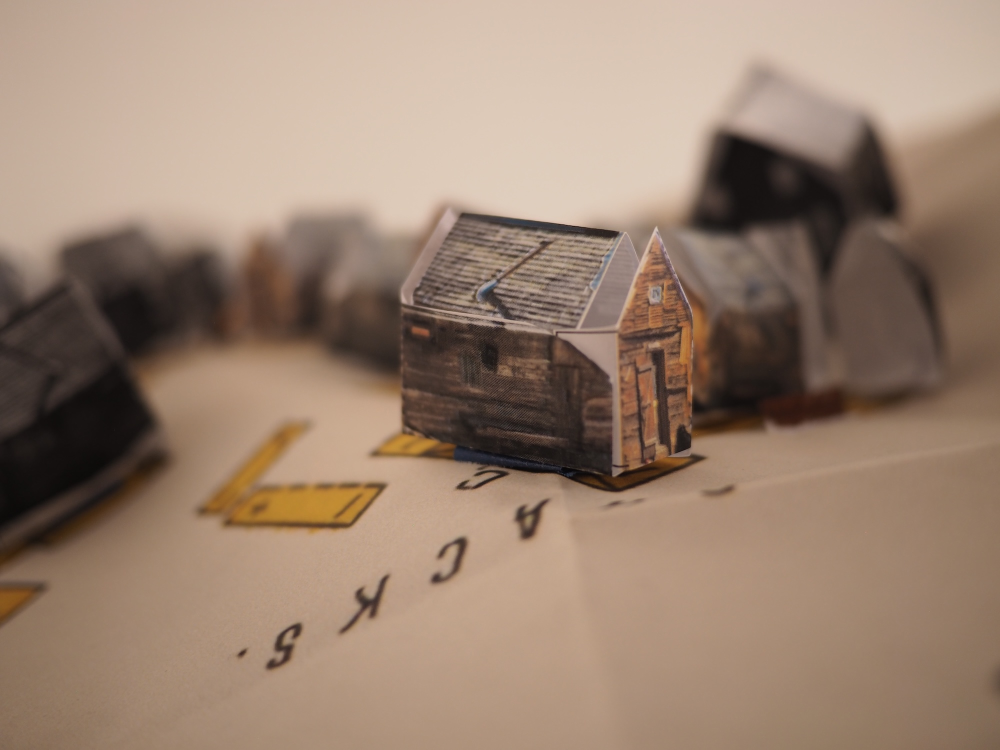
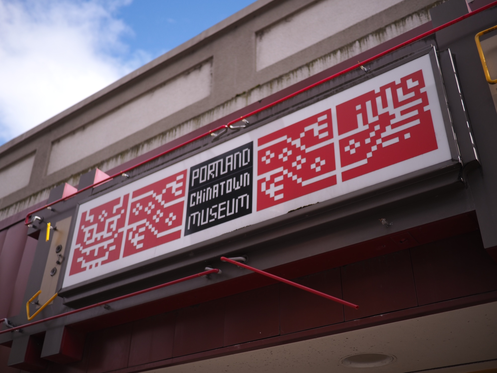
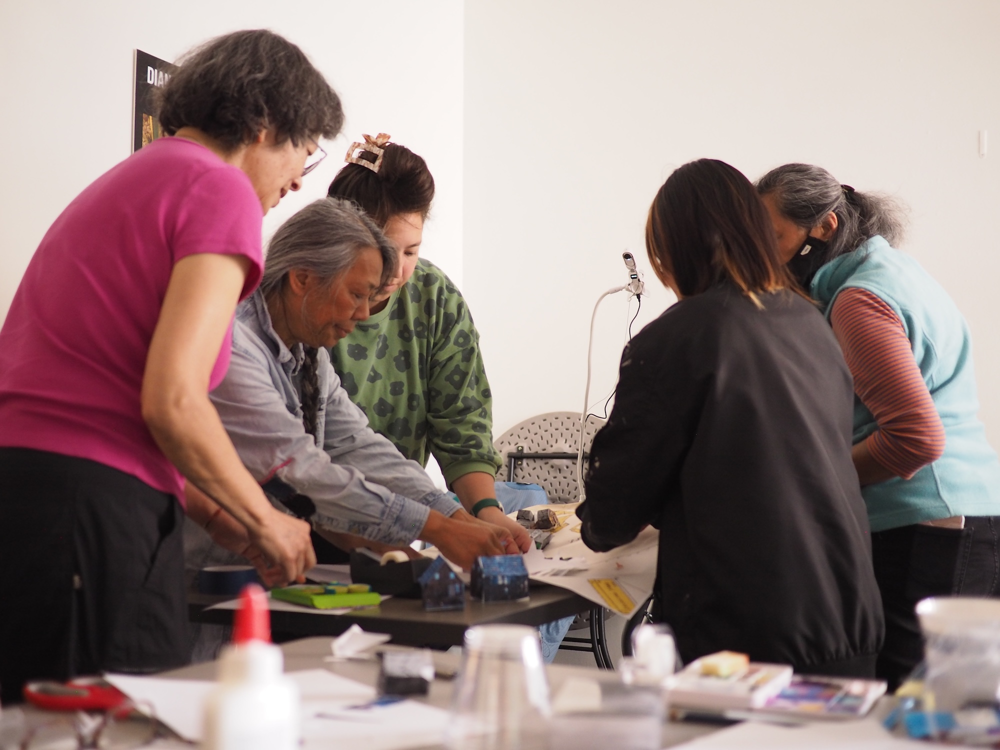
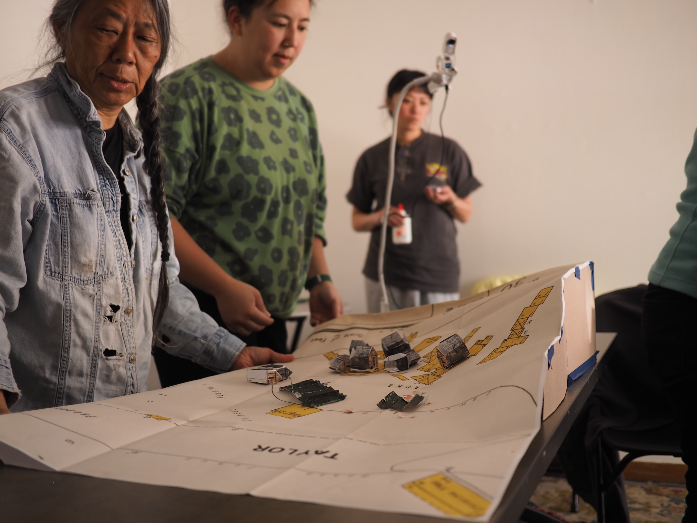
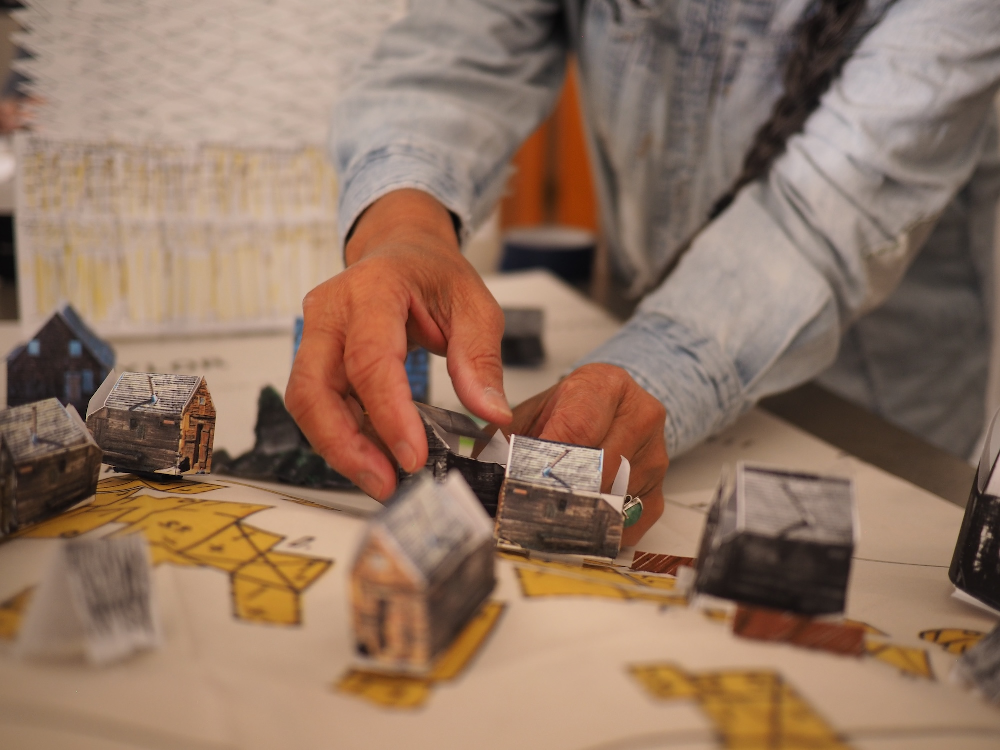
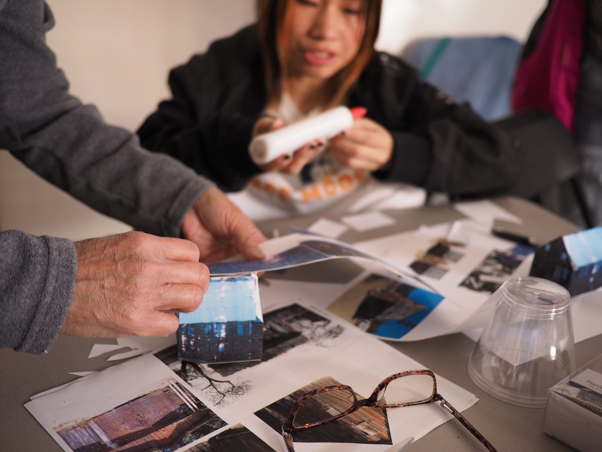
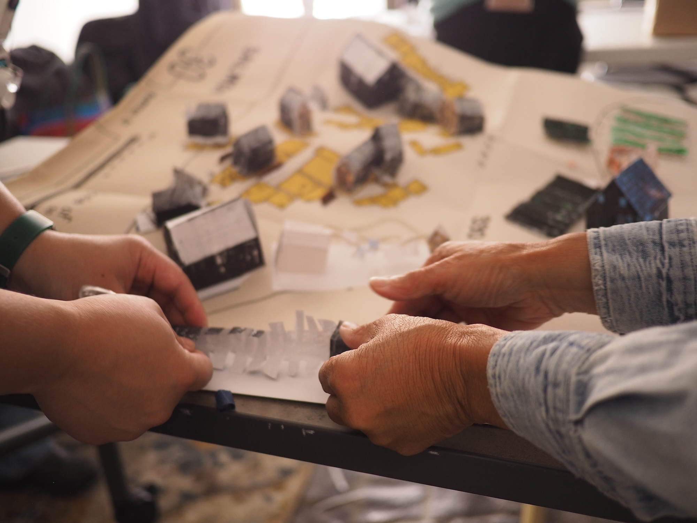
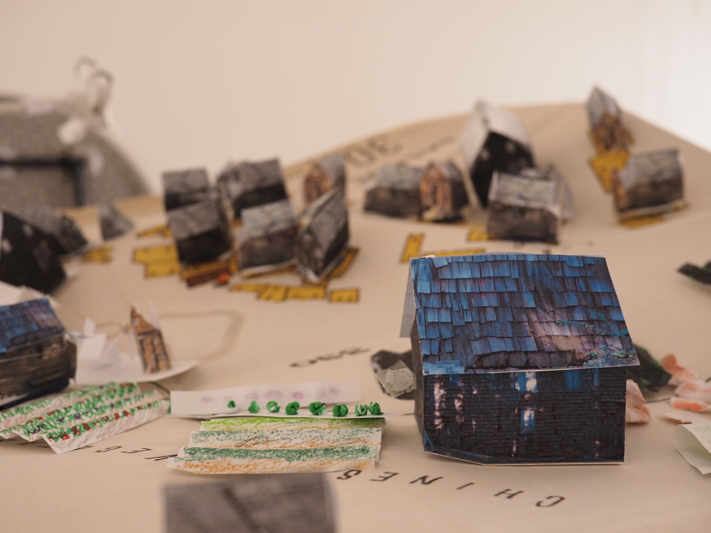
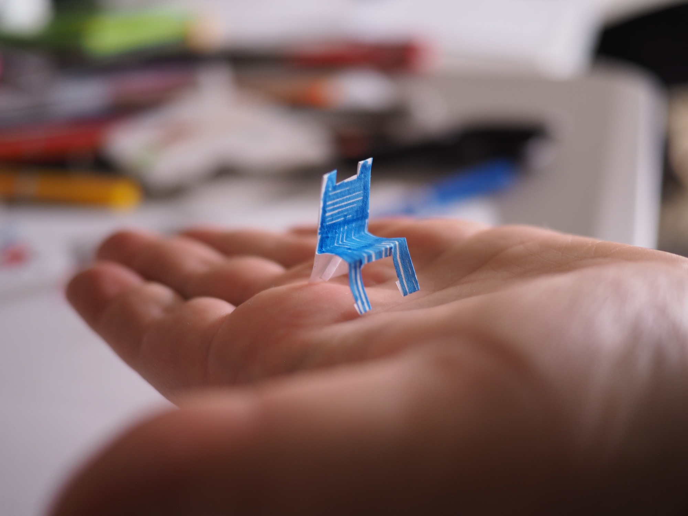
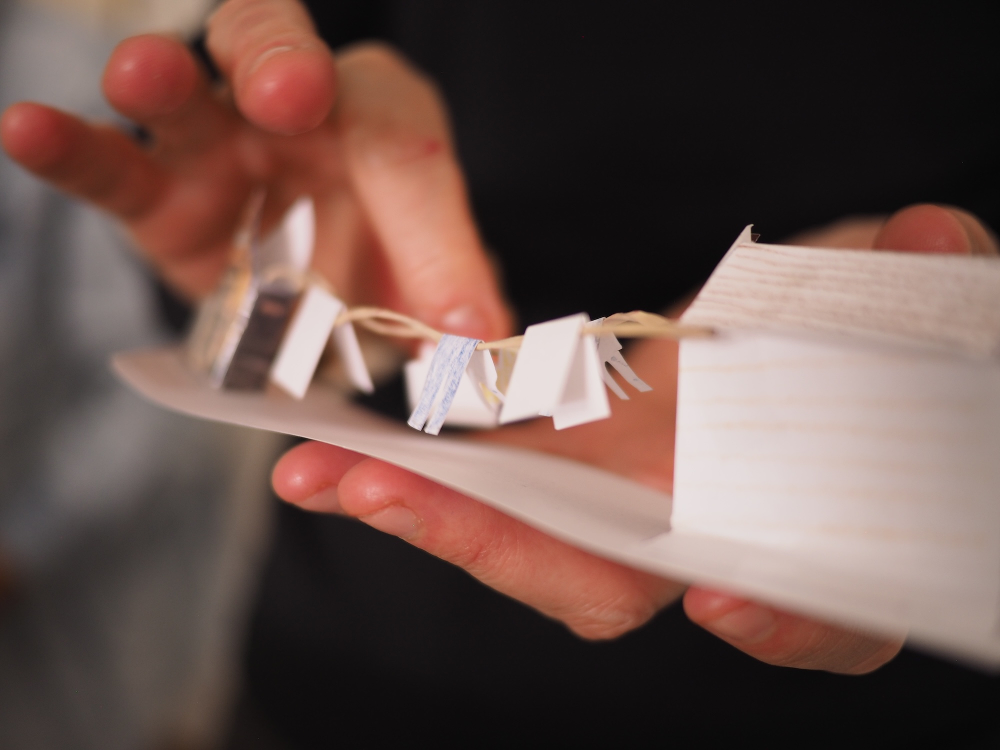

# Collective paper reconstructions at the Portland Chinatown Museum

_December 1, 2024_

 
Could relational reconstruction be a collaborative papercraft project? A zine?

This June, [Dri Chiu Tattersfield](https://hellodri.itch.io/) (who helped write this post!) and I finally got to host a workshop together in Portland, and after publishing "[Providence Chinatown 1914: an enfolded memory path](https://jywarren.github.io/enfolded-memory-path)" and teaching Relational Reconstructions at the [School for Poetic Computation](https://sfpc.study/blog/reconnecting-together) this past winter, we really wanted to work with a group to prototype further. Working with the wonderful folks at the [Portland Chinatown Museum](https://www.portlandchinatownmuseum.org), we imagined and hosted a mid-day workshop where we gathered around a table with printed copies of archival images and maps of [Portland's Chinese Vegetable Gardens](https://blogs.loc.gov/thesignal/2023/05/relational-reconstruction-of-the-portland-chinese-vegetable-gardens/). 

Attendees, a largely Asian American group, learned more about the concept of Relational Reconstruction as Dri and I (and others I've collaborated with) have imagined it. We then began to cut out pictures of houses and other landscape features, while two people fashioned a sloped hillside from a large print of a Sanborn insurance map from the late 1800s. 

We were honored to work with artist Roberta Wong and her sister Janet Wong, whose grandfather moved to Portland in ~1920, and who grew up in and around Chinatown, and artist [Lynn Yarne](https://lynnyarne.cargo.site/), whose work with artist [Shu-ju Wang](https://shujuwangartist.com/) in relation to these histories has been a major inspiration for Dri and I. Everyone brought distinct skills and personal stories to the work, and the hillside farming community of c1900 slowly emerged in the form of cabins, gardens, hanging laundry, as well as the high wall which segregated and hid this community from the neighboring Multnomah Athletic Club grounds. 

Dri and I had already been researching and crafting a digital reconstruction of the Chinese Vegetable Gardens, which made up a part of the [Hidden Portals project](https://hiddenportals.org) launched in May. Although the photos we had gathered in our research gave us a variety of views of the farming village, we also brought printed photos of other wooden buildings from early west coast Asian American communities from that period, including some present-day photos of the city of Locke (founded by Chinese American survivors of racist violence), and some from the remote (now abandoned) city of Howland Flat, CA. We have been deeply inspired by the critical fabulation work of Saidiya Hartman, and this re-use of materials is a part of our paper-based approach to speculating into gaps in the archive. The workshop idea originated when we asked: what would be meaningful as a reconstruction in Truckee, CA, where we have almost no records? We felt one possible answer was layering collective imaginations in collaborative reconstruction processes. It was amazing to try out this process at the Portland Chinatown Museum, and we’re very grateful to all the participants for experimenting with us! 

One of my favorite parts of this workshop was how intergenerational it was. And I also love the way we were able to incorporate textures and tactility into this work. Dri and I even added some flickering tea lights to see what it would have looked like at night! 

Dri asking "is this a zine" has become a kind of catchphrase, and I can't wait for our next zine project. 

