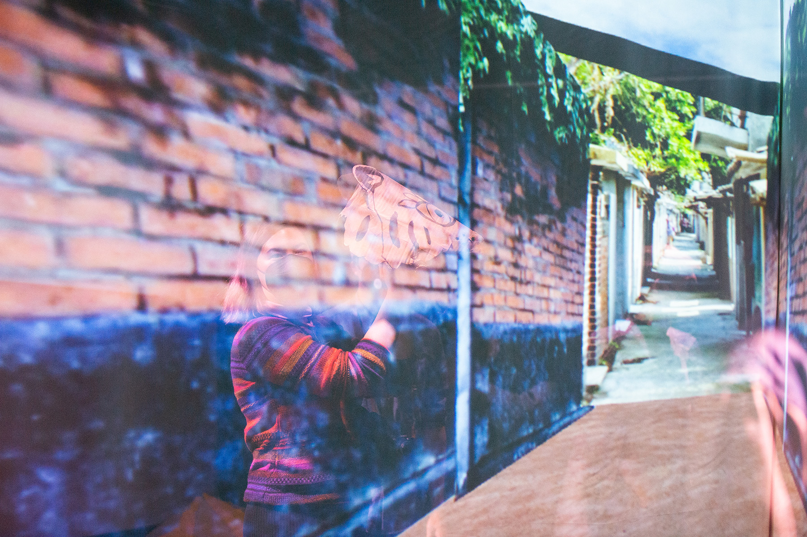
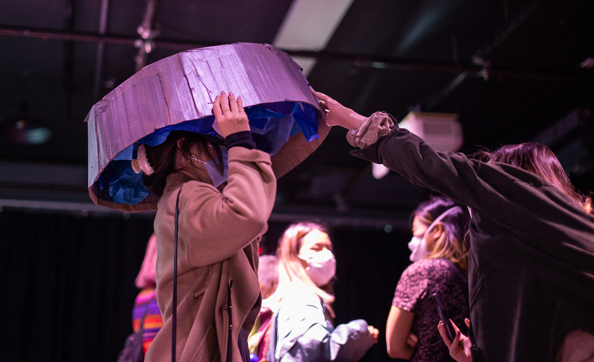
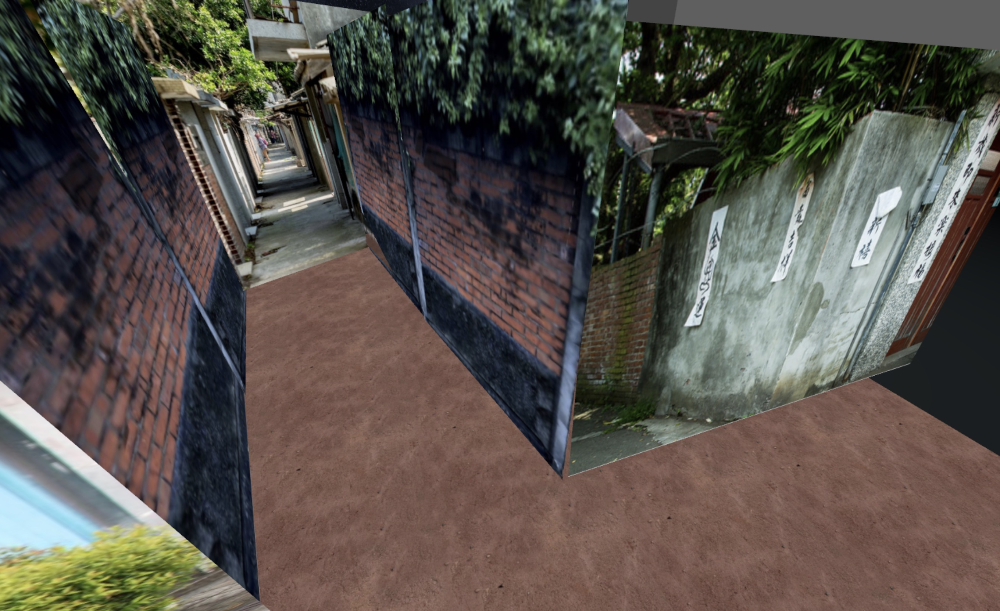

# Alleys, Taipei, 1980s

_[Ann Chen](https://annhchen.com/)_

My gonggong and popo lived in a Juancun 眷村, military dependents' village in Hsinchu when I was little, back in the 80s and 90s. They were supposed to be temporary homes in Taiwan to house soldiers, marines, airmen and their families who fought for the Kuomintang back during the Chinese civil war. They ended up becoming more semipermanent. I can't remember when, but the village my grandparents lived in was eventually razed and everyone living in them were placed in apartment building complexes, often built in the same location.

They didn't have infrastructure so I remember using a chamber pot when visiting and bathing in a bathtub. Or maybe this memory is built upon a photo of my baby brother standing naked in a bathtub at their home. In any case, I grew up in the US and remember going back to visit in the summers. My favorite or most distinct memory was running along the narrow alleyways and paths connecting the homes in the village.

[&laquo; Back to gallery](#)

