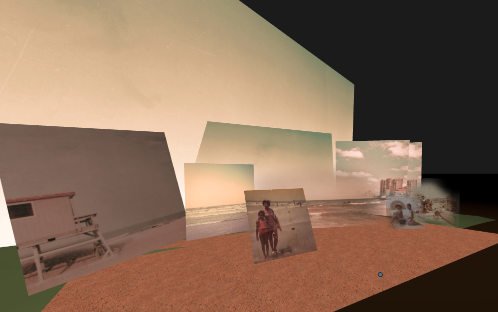

# American Beach, Jacksonville, FL, 19xxs

_[Brandi Kinard](https://brandikinard.com/)_

The photo in my memory enclave project is a true treasure. It features a snapshot of my mom at about eight years old and my grandmother at the American Beach in Jacksonville, Florida in the late 1960s. This was the only beach in Florida that welcomed Blacks and offered safe and secure accommodations during the Jim Crow era. My mom always reminisces on those trips from Charlotte, NC to Jacksonville, FL that her family would take every summer break in her childhood to visit family, wherein they would embark on a risky journey through the Jim Crow South, being forced to sleep in the car and take rest breaks on the side of the rural road to avoid being harassed by Whites or have their lives threatened for stopping at hotels or public restrooms. There wasn't much hospitality for traveling colored people as you can imagine during that time. She said these trips would be as scary as the potential of jellyfish stinging you in the waist-height water.

But you know what? I'm not content to let this powerful memory live on with bad undertones and the tragedy of Jim Crow plastered all over it. Oh no! I wanted to recreate the joy of that day at the beach and show my family as a normal, happy group.

[&laquo; Back to gallery](#)

