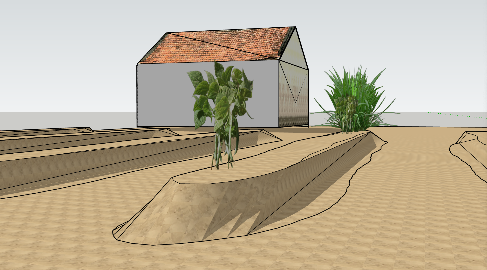

# Xiantao, China, 1960s

_[Caroline Hu](https://www.hudrewthis.com)_

This is the home both my grandfather and father grew up in. The structure and plot still belong to my family and is now surrounded by remodeled houses. Whether the 老家 or "old home" gets similarly renovated is a point of contention between my grandfather, (pro), and father, (against).

[&laquo; Back to gallery](#)

