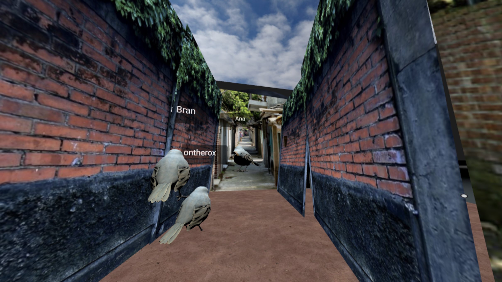
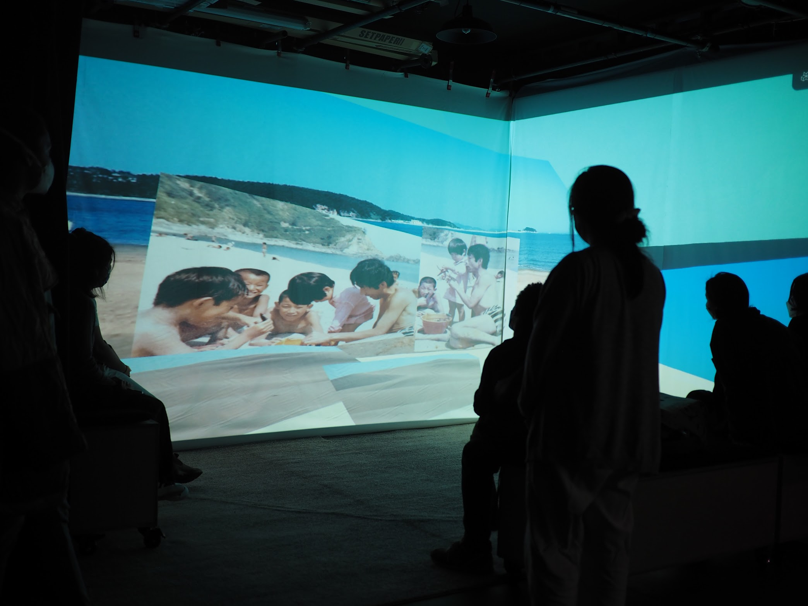
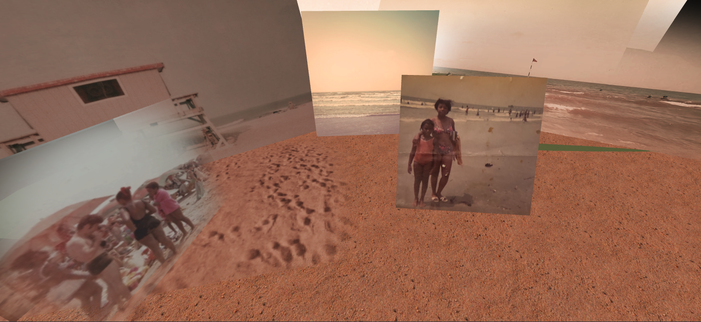
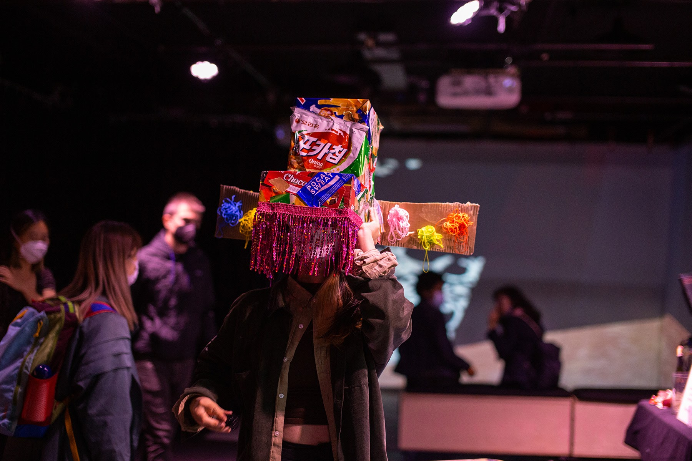
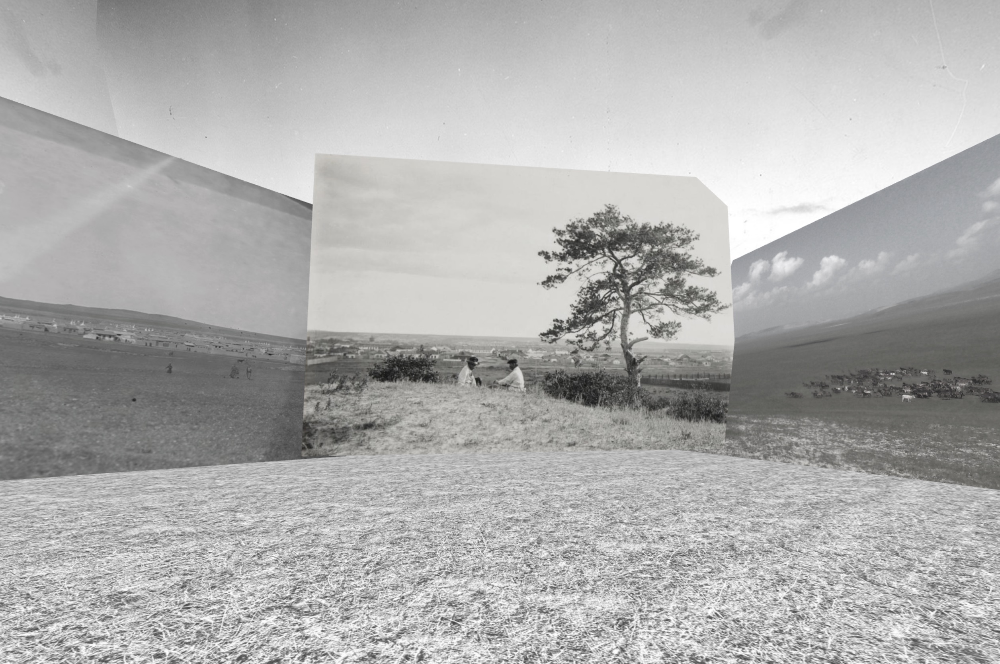
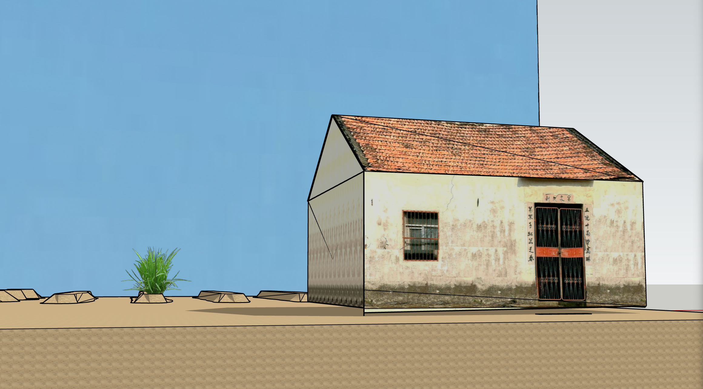
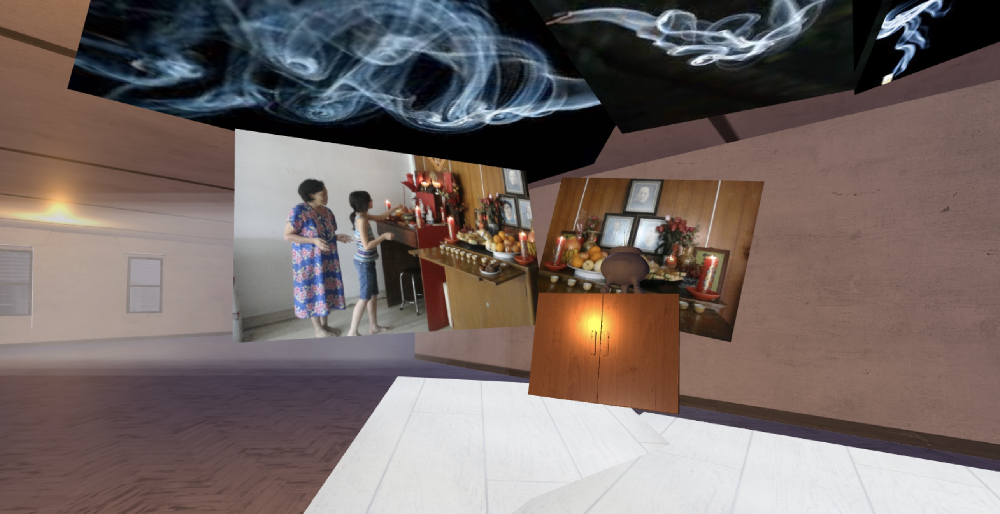

# Ancestral Memory Enclaves

In this workshop series, using "memory objects" – photos from personal archives of one's family, chosen family, and/or historical records – as windows into ancestral moments, participants  employ digital tools to speculatively re-create the space – and the feeling – around the view visible in each photo. Inspired by the re-existencia work of Kazakh artists [Aisha Jandosova](https://instagram.com/towardsanidealplace) and [Aida Issakhankyzy](https://www.instagram.com/waqitjariqkenistik/), the YA literature of Linda Sue Park, and the speculative fiction of Octavia Butler’s Patternmaster series, we talk through different approaches to remembering and being in relationship with ancestral stories – through craft, through narrative, through sensory practices and through spatial reconstruction – and their meanings to those of us with minoritized or diasporic identities seeking re-connection or re-unification. 

Read more about the broader project at [Seeing Providence Chinatown](/chinatown) and [Seeing Lost Enclaves](https://jywarren.github.io/seeing-lost-enclaves/)

## [Mapo-gu, Seoul, 1970s](2023/4/1)
_Jeffrey Yoo Warren Apr 1, 2023_

## [Alleys, Taipei, 1980s](ann-chen)
_Ann Chen Feb 17, 2022_

## [Beach, Korea, 1970s](soyoung-l-kim)
_Soyoung Kim Dec 5, 2022_

## [American Beach, FL, 1960s](brandi-kinard)
_Brandi Kinard Mar 26, 2022_

## [Eastern Taiwan, 1990s](dri-chiu-tattersfield)
_Dri Chiu Tattersfield Mar 26, 2022_

## [Busan, 1950s](jasmine-hwang)
_Jasmine Hwang Dec 5, 2022_

<!--

## [Mongolian Steppe, 1920s](jean-ni)
_Jean Ni Mar 26, 2022_

-->

## [Xiantao, China, 1960s](caroline-hu)
_Caroline Hu June 8, 2023_

## [Bogor, Indonesia, 2008](olivia-ong-evans)
_Olivia Ong Evans July 20, 2022_

## [Kunming, 2019](yutong-lin)
_Yutong Lin July 20, 2022_

----

