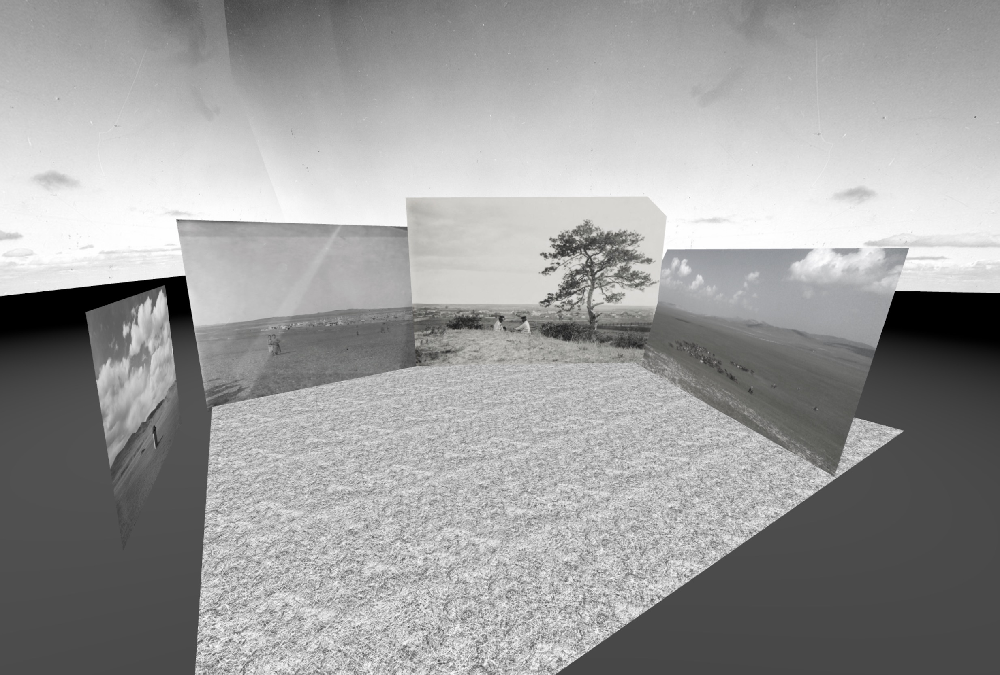

# Mongolian Steppe, 1920s

_[Jean Ni](https://jean-ni.space/)_

My proximity to ancestry wavers through moments of elasticity, severance, and confusion over time. When I've asked my Mongolian grandmother about her homeland, her dismissal and diversions point to a thick veil of willed forgetting informed by unnamed traumas. How do you reconcile the chasms between feeling history and learning one? What does it mean to connect to the ancient?

I don’t have any photos of my grandmother from her time spent in Mongolia before she immigrated to Beijing, but I do know that she grew up in an area called 哲里木盟 (Zhe-Li-Mu Meng), roughly meaning “the gathering place of grassland herdsmen.” This area is now known as Tongliao city in the Horqin District of Inner Mongolia. 

To conjure these ancestral memories I explored a simple, intimate embodiment of place using my own childhood recollections of a visit to Hailar paired with local visual textures and familiar sounds of the Steppe.

[&laquo; Back to gallery](#)

