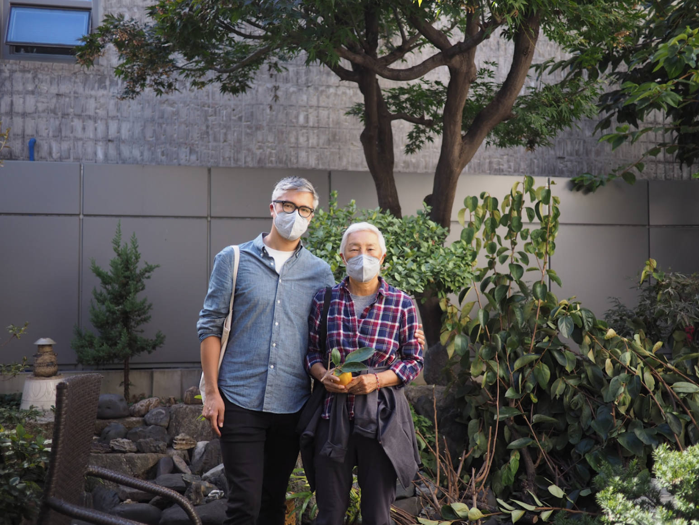

# Mapo-gu, Seoul, 1970s

This past fall, I visited Seoul for the first time in 20 years, traveling with my mom. Walking in the neighborhood, looking around for this house, a woman saw us and offered us a persimmon. She then led us to the home she'd lived in since she was a little girl, which turned out to be my mother's house. Here's a photo of us in the same garden as the 1970s photograph.

I wanted to know not just what was going on, but what that moment was like, what it sounded and felt like. The poet Roger Robinson writes of a portable paradise, “carried on my person, concealed” as one navigates the world far from home — what was such a place, to my ancestors, and what would it mean to me today? I’m reminded of a question I sometimes ask in workshops: “how might a message from your ancestors be encoded, and what might it say?”

This little memory space, crafted in paper, with accompanying soundtrack, will be my contribution to the @bburi_roots book, and many thanks to @andreleebassuet and @juleskangsharpe for working through the production details with me and providing feedback this past weekend!

To craft this ancestral memory enclave, I sat with my mother for almost an hour, listening but also asking: about textures and sounds and feelings. Learning about the newly planted plum trees, and the steam rising from the neighborhood bath house in the distance. And we created this place in a virtual environment, as a place where it was still snowing, where you could turn left or right or look up or down (like Lynda Barry). 

This past fall, I visited Seoul for the first time in 20 years, traveling with my mom. Walking in the neighborhood, looking around for this house, a woman saw us and offered us a persimmon. She then led us to the home she’d lived in since she was a little girl, which turned out to be my mother’s house. Here’s a photo of us in the same garden as the 1970s photograph.

_[Jeffrey Yoo Warren](https://unterbahn.com) is an artist educator based in Providence, RI, on Naragansett and Wampanoag land, who lives in the neighborhood which was Providence's Chinatown from 1904-1914._ 

