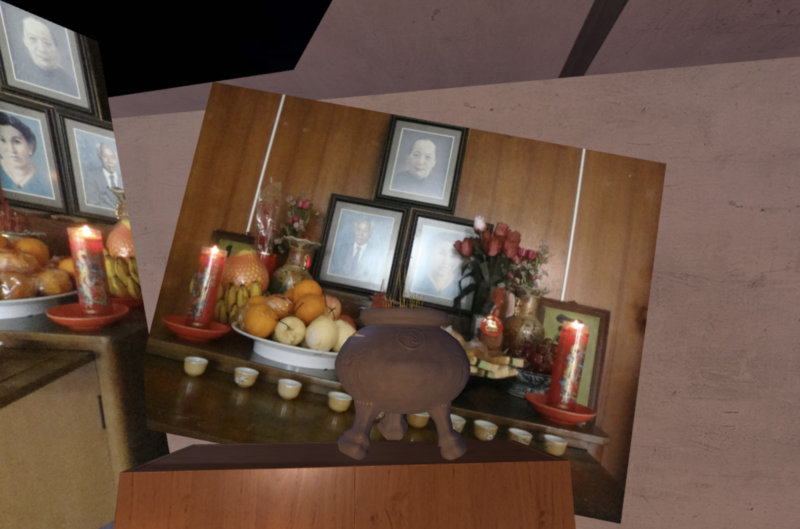

# Bogor, Indonesia, 2008

_[Olivia Ong Evans](https://www.oliviaongevans.com/)_

These images were taken the first time I visited my mother’s hometown and childhood home in Bogor, Indonesia. My aunt showed me how to use incense to pray at the altar—a physical space to hold memories of ancestors. The process of digitally recreating this moment allowed me to reflect on how family traditions have changed over generations and migrations. There are many ways I try to recreate versions of practices like this one in my own life today. Even just the act of remembering can feel like a spiritual practice. 

[&laquo; Back to gallery](#)

